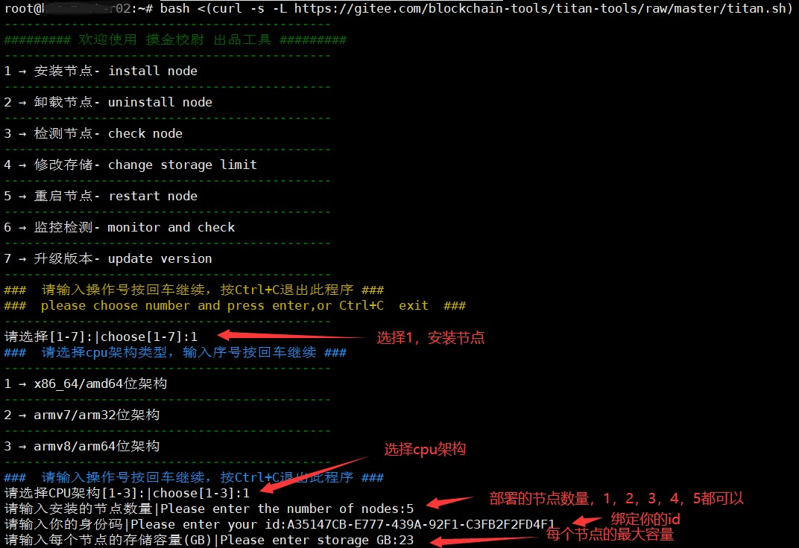

# titan-tools

## 推荐码UtYELY
#### 介绍
titan-network节点 Linux系统批量部署、升级、维护工具，支持一键更新。自主选择部署节点数量，自动安装监控，故障自动重启。
一键部署完自动安装监控，无需再单独安装监控。

#### 软件架构
shell脚本，linux系统运行，支持ubuntu、armbian、debian、hiveos、centos，无需docker
支持x86_64、arm32、arm64，支持树莓派、香橙派、斐讯N1、玩客云、章鱼星球、机顶盒等arm设备

centos只支持8和stream版本，7不支持    
centos只支持8和stream版本，7不支持    
centos只支持8和stream版本，7不支持   
   

#### 安装教程
在终端中输入以下命令，回车执行：

`bash <(curl -s -L https://gitee.com/blockchain-tools/titan-tools/raw/master/titan.sh)`

#### 使用说明

1.  部署太快可能会因为主网的访问失败导致节点注册失败，手动注册方法如下（复制全部命令）：
`for i in {1..5};do sudo -u admin$i titan-edge bind --hash=A35147CB-E777-439A-92F1-C3FB2F2FD4F1 https://api-test1.container1.titannet.io/api/v2/device/binding;done`

2. 官网 https://test1.titannet.io/intiveRegister?code=UtYELY

3. 官方原版教程：https://titannet.gitbook.io/titan-network-cn
4. 官方的节点管理命令在这里
`https://titannet.gitbook.io/titan-network-cn/herschel-testnet/yun-hang-jie-dian-zhuan-qu/cli-guan-li-ming-ling`  
所有命令前面加上sudo -u admin1或者sudo -u admin1，管理哪个节点admin后面数字就改成几。
5. 交流q群:  522696951